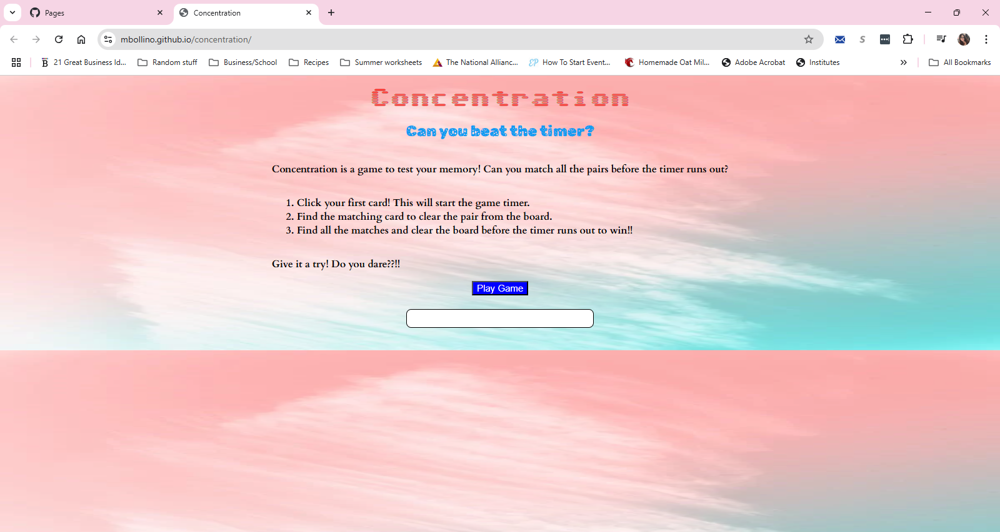

# Concentration

## Screenshot:

## Description of Concentration game:
Concentration is a memory game where you flip over cards to find matching colors.  You are allowed to flip over 2 cards for the game to compare for a match.  Once you start play, a timer is set & you will have 60 seconds to find all matches to win.  If you do not find all matches before the timer ends, then you lose the game.

## Getting started:
Click here to play [Concentration](https://mbollino.github.io/concentration/).

**Planning materials:**
>/*-------------- Constants -------------*/

>*const cards = [*
  >>  {  
    >>    name: "Pet1",  
      >>  src: "./assets/Pet1.jpg",  
      >>  // id: [1,16],  
      >>  alt: "alt"  
  >>  },  
 >>   {  
        name: "Pet2",  
        src: "./assets/Pet2.jpg",  
        // id: [2, 17],  
        alt: "alt"  
    },  
    {    
        name: "Pet3",  
        src: "./assets/Pet3.jpg",  
        // id: [3, 18],  
        alt: "alt"  
    },  
    {  
        name: "Pet4",  
        src: "./assets/Pet4.jpg",  
        // id: [4, 19],  
        alt: "alt"  
    },  
    {  
        name: "Pet5",  
        src: "./assets/Pet5.jpg",  
        // id: [5, 20],  
        alt: "alt"  
    },  
    {
        name: "Pet6",  
        src: "./assets/Pet6.jpg",  
        // id: [6, 21],  
        alt: "alt"  
    },  
    {  
        name: "Pet7",  
        src: "./assets/Pet7.jpg",  
        // id: [7, 22],  
        alt: "alt"  
    },  
    {  
        name: "Pet8",  
        src: "./assets/Pet8.jpg",  
        // id: [8, 23],  
        alt: "alt"  
    },  
    {    
        name: "Pet9",  
        src: "./assets/Pet9.jpg",  
        // id: [9, 24],  
        alt: "alt"  
    },  
    {  
        name: "Pet10",  
        src: "./assets/Pet10.jpg",  
        // id: [10, 25],  
        alt: "alt"  
    },  
    {  
        name: "Pet11",  
        src: "./assets/Pet11.jpg",  
        // id: [11, 26],  
        alt: "alt"  
    },  
    {  
        name: "Pet12",  
        src: "./assets/Pet12.jpg",  
        // id: [12, 27],  
        alt: "alt"  
    },  
    {  
        name: "Pet13",  
        src: "./assets/Pet13.jpg",  
        // id: [13, 28],  
        alt: "alt"  
    },  
    {  
        name: "Pet14",  
        src: "./assets/Pet14.jpg",  
        // id: [14, 29],  
        alt: "alt"  
    },  
    {  
        name: "Pet15",  
        src: "./assets/Pet15.jpg",  
        alt: "alt"  
    }  
]  

>>const cardPickList = [...cards, ...cards]  
let cardCount = cardPickList.length**

>/*---------- Variables (state) ---------*/

>>let flippedCard = [];  
let win;  
let matchedCards = [];  
// let noMatch = []  

>/*----- Cached Element References  -----*/

>>const cardEls = document.querySelectorAll('.card')  
const frontEls = document.querySelectorAll('.front')  
const messageEl = document.querySelectorAll('.msg')  
const instEl = document.querySelectorAll('.instructions')  
const startBut = document.getElementById('start')  
const timeLeft = document.getElementById("timer-countdown-inner-blue")  
const countdownBar = document.getElementById("timer.countdown")  

>/*-------------- Functions -------------*/

>>const init = () => {  
    flippedCard = [],  
    win = false,  
    matchedCards = []  
    // noMatch = []   
}   
// init()  

>>const handleClick = () => {  
    shuffleCards()  
    flipCard()  
}  
const buildFront = (cardElement) => {  
    frontEls.forEach((card => {  
        card.style.backgroundImage = `url(${cardElement.src})`  
        // card.classList.toggle = "is-flipped"     
    console.log(card)  
    }))  
}  

>>const shuffleCards = () => {  
    for(let i = 0; i < cardCount; i++) {  
        const randomIndex = Math.floor(Math.random() *   cardPickList.length)  
        const card = cardPickList[randomIndex]  
            const front = buildFront(card)  
            cardPickList.splice(randomIndex, 1) //remove image   from list to prevent duplicates  
        }  
 

>>        // setTimeout(() => {  
  >>  // }, 8000)  
    }  

>>const flipCard = () => {  
    this.classList.add('is-flipped')  
    if(flippedCard.length < 2 && !this.classList.contains  ('is-flipped')) {  
        this.classList.add('is-flipped');  
        flippedCard.push(this);  
        runTimer()  

  >>      if(flippedCard.length === 2) {  
  >>          checkForMatch();  
  >>          clearInterval(timer)  
  >>      }  
  >>  }  
}  

>>const checkForMatch = () => {  
    const card1 = flippedCard[0];  
    const card2 = flippedCard[2];  

>>    if(card1.name === card2.name) {  
        matchedCards.push(card1,card2);  

>>        checkForWinner()  
  >>  }
    if(card1.name !== card2.name) {  
        card1.push(noMatch);  
        card2.push(noMatch);  
    }  
 }  
 
>>const runTimer = () => {  
    var startTimer = setInterval(barCount,5);  
    const barCount = () => {  
        if(timeLeft.clientWidth < countdownBar.clientWidth) {  
            timeLeft.style.width = timeLeft.clientWidth + 1 + 'px'  
        } else {  
            timeLeft.style.width = countdownBar.clientWidth + 'px'  
            clearInterval(startTimer)  
            win = false  
        }  
    }  
}  

>>// const checkForWinner = () => {}  

>/*----------- Event Listeners ----------*/  

>>startBut.addEventListener("click", shuffleCards)  

>>for(let i = 0; i < cardEls[i]; i++) {  
    cardEls[i].addEventListener("click", handleClick)  
}  
 
>>// .active, .instructions:hover {  
//     background-color: rgb(255,255,0)  
//   }  
  
>>//   .content {  
//     padding: 0 18px;  
//     display: none;  
//     overflow: hidden;  
//     font-size: 15px;  
//     line-height: 10pt;  
//     float:left;  
//     vertical-align: bottom;  
//   }

>>/* <section class="message">  
>>
No match, select again!
  
>>
Great job! Select again!
  
>>
Congratulations! You win!
  
>>
Too bad! You lose!
  
>></section> */  

>>// .message {  
//     text-align: center;  
//     visibility: hidden;  
//   }  
  
>>//   #no-match {  
//     font-size: 25px;  
//     color: rgb(255,255,0)  
//   }  
  
>>//   #match {  
//     font-size: 25px;  
//     color: rgb(100, 214, 87);  
//   }  
  
>>//   #win {  
//     font-size: 40px;  
//     color:rgb(43, 223, 226)  
//   }  
  
>>//   #lose {  
//     font-size: 30px;  
//     color: rgb(255,0,0)  
//   }  
  

## Attributions:  
Google Fonts:  
[Sixtyfour Convergence](https://fonts.googleapis.com/css2?family=Fontdiner+Swanky&family=Honk&family=Neonderthaw&family=Parisienne&family=Sixtyfour+Convergence&family=Yatra+One&display=swap)  
[Rubik Gemstones](https://fonts.googleapis.com/css2?family=Rubik+Gemstones&display=swap)  
[Cardo](https://fonts.googleapis.com/css2?family=Cardo:ital,wght@0,400;0,700;1,400&display=swap)  

Pictures:  
[Background](https://images.pexels.com/photos/2088205/pexels-photo-2088205.jpeg?auto=compress&cs=tinysrgb&w=600)  
[Back of cards](https://images.pexels.com/photos/1279813/pexels-photo-1279813.jpeg?auto=compress&cs=tinysrgb&w=600)  

## Technologies used:
Javascript  
HTML  
CSS

## Stretch goals:
**Play Game button:** When site is initialized, heading 1 & 2 appear & directions fill screen.  Timer is not visible.  When Play Game button is clicked, the directions are moved into a collapsible text box on the side of the screen, Play Game button is hidden, and Timer becomes visible.  All cards flip at once to give player a preview of the board for 8-10s, then they flip back over & player starts to look for matches.   
**Replay Game Button:** When game ends, win or lose, & in addition to win or lose game message, the "Replay Game" button appears, blinking on screen. When pressed, new game is started.  
**3 strike or 5 strike rule:** Implement a 3 strike rule or a 5 strike rule - If player has 3 incorrect guesses, they lose (or 5 incorrect guesses).  
**Progressive gameplay:** Implement progessive gameplay - start with a 4x4 board and as the levels get higher, the board gets bigger or give the option to play with or without the timer.  Or choose the size of the board both in timed games & untimed gameplay.

